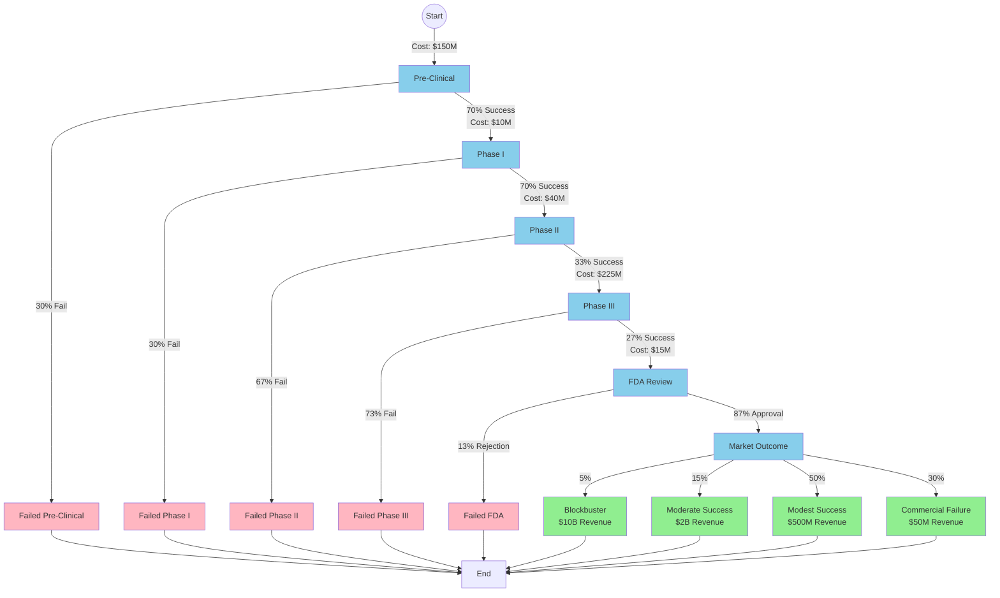

# Case Study: Drug Development Decision Framework

## Overview

Drug development is one of the most complex, expensive, and uncertain decision processes in business. A typical drug takes 10-15 years and costs $1-2 billion to bring to market, with only 5-14% of drugs that enter clinical trials ultimately receiving FDA approval. This multi-stage process involves sequential decisions with massive uncertainty at each phase, making it an ideal candidate for the petersburg framework.

## The Decision Process

### Phase Structure

Drug development follows a well-defined but highly uncertain sequence:

1. **Pre-Clinical Research** (3-6 years)
   - Laboratory and animal testing
   - Cost: ~$100-200M
   - Success rate: ~70% proceed to Phase I

2. **Phase I Clinical Trials** (1-2 years)
   - Safety testing in 20-100 healthy volunteers
   - Cost: ~$5-15M
   - Success rate: ~70% proceed to Phase II

3. **Phase II Clinical Trials** (2-3 years)
   - Efficacy testing in 100-300 patients
   - Cost: ~$20-60M
   - Success rate: ~33% proceed to Phase III

4. **Phase III Clinical Trials** (2-4 years)
   - Large-scale testing in 300-3,000 patients
   - Cost: ~$150-300M
   - Success rate: ~25-30% receive FDA approval

5. **FDA Review** (1-2 years)
   - Regulatory review and approval
   - Cost: ~$10-20M
   - Success rate: ~85-90% of submissions approved

6. **Market Launch**
   - Potential revenue: $500M - $5B annually for blockbuster drugs
   - But many approved drugs fail commercially

## Key Decision Points

At each phase transition, pharmaceutical companies face a critical GO/NO-GO decision:

- **Continue**: Invest more capital in the next phase
- **Stop**: Abandon the drug candidate and cut losses
- **Pivot**: Modify the drug or target different indications

The challenge is that most costs are "sunk" - spent before knowing if the drug will succeed. Each decision must be made under uncertainty, with probabilities based on:
- Preliminary efficacy data
- Safety signals
- Competitive landscape
- Market size projections
- Regulatory feedback

## Inversion Analysis

A key question pharmaceutical executives ask: **"What would have to be true for this drug to be worth a $2B investment?"**

Using the petersburg framework's concept of inversion, we can work backward:

1. **Required outcome**: Drug generates $10B in revenue (5x return)
2. **Market requirements**:
   - Must treat prevalent condition (>1M patients)
   - Must be superior to existing treatments
   - Must achieve blockbuster pricing ($50K+/year)
3. **Clinical requirements**:
   - Phase III must show statistically significant benefit
   - Safety profile must be manageable
4. **Phase II requirements**:
   - Must show strong efficacy signals
   - Must identify optimal dosing
5. **Phase I requirements**:
   - Must demonstrate acceptable safety in healthy volunteers

By modeling this as a graph, we can identify which assumptions are most critical and where the highest uncertainties lie.

## Why This Fits Petersburg Framework

1. **Sequential decisions with dependencies**: Each phase depends on success in prior phases
2. **Probabilistic outcomes**: Each phase has uncertain success rates
3. **Asymmetric payoffs**: Small probability of massive success vs. high probability of total loss
4. **Path dependencies**: Early decisions (target selection, drug design) influence later probabilities
5. **Costs at each edge**: Each transition requires major capital investment
6. **Multiple ending states**: From complete failure to blockbuster success

## Real-World Examples

### Success Story: Keytruda (Pembrolizumab)
- Merck's cancer immunotherapy
- Accelerated through trials based on strong Phase I/II signals
- Now generates >$20B annually
- Demonstrates the massive upside of the right path through the graph

### Failure Story: Alzheimer's Drug Development
- Multiple companies (Pfizer, Eli Lilly, Biogen) have invested billions
- >99% failure rate in Alzheimer's clinical trials
- Many Phase III failures after $500M+ investments
- Illustrates how late-stage failures can be catastrophic

## Strategic Implications

The petersburg framework helps pharmaceutical companies:

1. **Portfolio optimization**: Balance high-risk/high-reward vs. safer bets
2. **Go/No-Go decisions**: Quantify the expected value at each decision point
3. **Resource allocation**: Determine optimal investment levels per phase
4. **Risk management**: Identify which uncertainties matter most
5. **Scenario planning**: Model "what if" scenarios for different trial outcomes
6. **Licensing decisions**: Value in-licensing vs. internal development

## References

- FDA Drug Development Process: https://www.fda.gov/patients/drug-development-process
- Clinical trial success rates: Thomas et al., "Clinical Development Success Rates 2006-2015"
- Cost estimates: Wouters et al., "Estimated Research and Development Investment Needed to Bring a New Medicine to Market"
