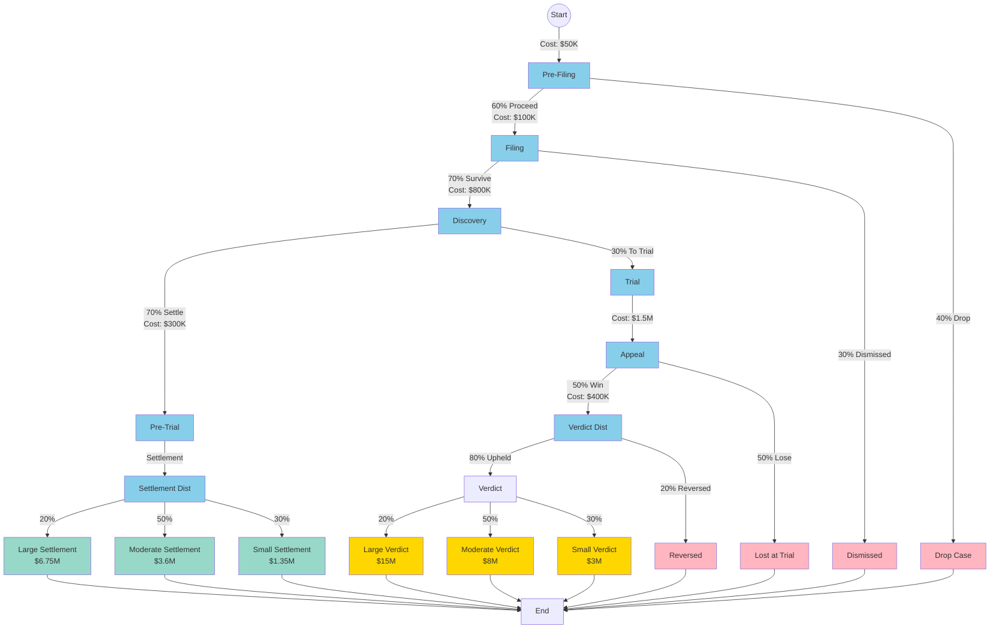

# Case Study: Litigation Strategy Decision

## Overview

Legal disputes involve sequential decisions under extreme uncertainty, with costs escalating at each stage and outcomes determined by judges, juries, and opposing parties. Whether to sue, settle, or fight to trial is one of the most consequential decisions companies and individuals face.

Litigation perfectly fits the petersburg framework: it's a multi-stage process with clear decision points, probabilistic outcomes, escalating costs, and the potential for both catastrophic losses and significant wins. The framework helps answer critical questions like "Should we settle now or proceed to trial?" and "What would have to be true for litigation to be worth pursuing?"

## The Decision Process

### Litigation Stages

1. **Pre-Filing Investigation** (1-3 months)
   - Assess merits of case
   - Gather initial evidence
   - Evaluate damages
   - Cost: $25K-$100K
   - Success rate: ~40% proceed to filing (many weak cases dropped)

2. **Filing & Initial Pleadings** (2-4 months)
   - File complaint or answer
   - Initial motions
   - Jurisdictional issues
   - Cost: $50K-$150K
   - Success rate: ~70% survive motion to dismiss

3. **Discovery Phase** (6-18 months)
   - Document production
   - Depositions
   - Expert witnesses
   - Cost: $200K-$2M
   - Success rate: ~60% reach trial (40% settle during discovery)

4. **Pre-Trial Motions** (2-4 months)
   - Summary judgment motions
   - Motion in limine
   - Settlement conferences
   - Cost: $100K-$500K
   - Success rate: ~30% go to trial (70% settle or dismissed)

5. **Trial** (1-4 weeks + prep)
   - Jury or bench trial
   - Present evidence
   - Verdict
   - Cost: $500K-$5M+
   - Win rate: Highly variable (30-70% depending on case type)

6. **Appeal** (12-24 months, if filed)
   - Appellate briefs
   - Oral arguments
   - Appellate decision
   - Cost: $200K-$1M
   - Success rate: ~10-20% of verdicts reversed

## Settlement vs. Trial Decision

At every stage, parties face the fundamental decision:

### Settlement Options:
- **Settle now**: Accept certain outcome, avoid further costs
- **Continue discovery**: Gather more information before deciding
- **Proceed to trial**: Gamble on jury verdict

### Key Variables:
- **Probability of winning at trial**: Often estimated 30-70%
- **Expected damages if win**: Can range from $0 to hundreds of millions
- **Expected costs to trial**: $500K-$5M for complex commercial litigation
- **Defendant's settlement offer**: Typically 30-60% of expected damages
- **Risk tolerance**: Publicly traded companies often prefer certainty

## Inversion Analysis

The classic question: **"What would have to be true for going to trial to be worth it?"**

### For Plaintiff:

Working backward from a break-even decision:

1. **Settlement offer**: $2M
2. **Costs to trial**: $1M
3. **Additional expected verdict**: Must exceed $3M to break even
4. **If probability of winning is 50%**: Expected verdict must be $6M+
5. **Therefore**: Only proceed if you can prove damages >$6M AND have >50% win probability

### For Defendant:

1. **Plaintiff demands**: $10M settlement
2. **Costs to trial**: $2M
3. **Expected verdict if lose**: $15M (estimated)
4. **Probability of losing**: 40%
5. **Expected cost of trial**: $2M + (0.40 × $15M) = $8M
6. **Therefore**: Should settle for anything <$8M

### Strategic Considerations:

- **Information asymmetry**: Each side has different estimates of win probability
- **Risk aversion**: $2M certain is often worth more than 50% chance of $4M
- **Reputational effects**: Some defendants "never settle" to deter future suits
- **Precedent value**: Winning may prevent copycat lawsuits
- **Time value**: Settlement today vs. verdict in 2+ years

## Why This Fits Petersburg Framework

1. **Sequential decisions**: Discovery → Pre-trial → Trial → Appeal
2. **Compounding uncertainty**: Must win at each stage
3. **Escalating costs**: Each stage costs exponentially more
4. **Path dependencies**: Early depositions affect settlement negotiations
5. **Multiple terminal states**: From complete loss to massive win
6. **Strategic interactions**: Opponent's decisions affect your outcomes
7. **Real options**: Can settle at any stage, buying information

## Real-World Examples

### Success Story: Plaintiff Patent Victory

**Case**: Small tech company sues Fortune 500 for patent infringement

- **Pre-filing**: Strong patent, clear infringement evidence
- **Initial offer**: Defendant offers $500K to go away
- **Plaintiff analysis**: 60% win probability, $20M potential damages
- **Decision**: Reject settlement, proceed to discovery
- **Discovery**: Finds internal emails showing willful infringement
- **New offer**: Defendant offers $5M
- **Decision**: Reject, proceed to trial (now 70% win probability)
- **Trial outcome**: Jury awards $18M
- **Appeal**: Affirmed on appeal
- **Total recovery**: $18M (minus $3M in legal fees = $15M net)

**Key insight**: Strong case with asymmetric payoff justified trial risk. Information gathered in discovery strengthened position.

### Failure Story: Weak Employment Case

**Case**: Employee sues for wrongful termination

- **Pre-filing**: Shaky evidence, "at-will" employment state
- **Filing**: Lawsuit filed seeking $2M
- **Initial offer**: Defendant offers $50K nuisance settlement
- **Plaintiff analysis**: "I'll definitely win, they were unfair!"
- **Decision**: Reject, proceed to discovery
- **Discovery costs**: $150K (more than settlement offer)
- **Depositions**: Reveal plaintiff had performance issues
- **Summary judgment**: Case dismissed before trial
- **Outcome**: Plaintiff pays own $150K in fees, gets $0

**Key insight**: Emotional decision-making ignored objective probabilities. Should have taken early settlement or not filed at all.

### Mixed Story: Class Action Settlement

**Case**: Securities fraud class action against public company

- **Filing**: Class action seeking $500M
- **Initial offer**: Defendant offers $10M
- **Plaintiff analysis**: 30% win probability, but high uncertainty
- **Discovery**: Expensive ($5M in costs to get to trial)
- **Mediator**: Suggests $50M settlement
- **Decision**: Settle for $45M
- **Outcome**: Reasonable recovery, avoided trial risk

**Key insight**: Moderate probability case with high costs favors settlement. $45M certain is worth more than 30% × $500M = $150M expected value (when accounting for risk and costs).

## Strategic Implications

### For Plaintiffs (Bringing Suit):

1. **Case selection**: Only sue when expected value clearly positive
2. **Early assessment**: Spend money on investigation before filing
3. **Settlement timing**: Best settlements often come mid-discovery
4. **Funding**: Consider litigation financing for strong cases
5. **Risk management**: Portfolio approach for law firms (multiple cases)

### For Defendants (Facing Suit):

1. **Early evaluation**: Assess merits immediately, don't ignore
2. **Strategic settlement**: Sometimes paying nuisance value is optimal
3. **Discovery strategy**: Use discovery to reduce plaintiff's win probability
4. **Never settle policy**: May deter frivolous suits but increases cost of real claims
5. **Insurance**: D&O insurance and litigation insurance reduce downside

### For Both Parties:

1. **Information value**: Discovery purchases information about win probability
2. **Time value of money**: Early settlements are more valuable
3. **Reputation**: Consider long-term effects on business relationships
4. **Precedent**: One case may affect many future cases
5. **Stress and attention**: Litigation consumes management time

## Probabilistic Scenarios

### Strong Plaintiff Case:
- Pre-filing → Filing: 80% (clear merits)
- Survive dismissal: 90%
- Reach trial: 40% (60% settle)
- Win at trial: 70%
- Survive appeal: 85%
- **Overall probability of trial win**: 17.1%
- **But**: 60% chance of favorable settlement during discovery

### Moderate Case:
- Pre-filing → Filing: 60%
- Survive dismissal: 70%
- Reach trial: 30%
- Win at trial: 50%
- Survive appeal: 80%
- **Overall probability of trial win**: 5.0%
- **Settlement more likely than trial victory**

### Weak Defendant Case:
- Pre-filing → Filing: 40% (plaintiff may not even sue)
- Survive dismissal: 50% (good chance of early dismissal)
- Reach trial: 20%
- Win at trial: 30%
- **Overall probability of trial win**: 1.2%
- **Should settle early or focus on dismissal motions**

## Decision Framework

### Green Light (Proceed to Trial):
- Win probability >60%
- Damages justify costs (expected value 3x+ litigation costs)
- Strong evidence that will hold up at trial
- Defendant unwilling to offer reasonable settlement
- Precedent value or deterrent value to winning

### Yellow Light (Proceed with Caution):
- Win probability 40-60%
- Moderate damages relative to costs
- Some evidence issues but fixable
- Settlement discussions ongoing
- Need discovery to assess true merits

### Red Light (Settle or Drop):
- Win probability <40%
- Damages don't justify costs
- Evidence is weak or impeachable
- Reasonable settlement offer on table
- High risk of adverse precedent if lose

## The Settlement Range

Most cases settle because there's a zone where both sides prefer settlement:

**Example:**
- Plaintiff's expected value of trial: $5M
- Plaintiff's trial costs: $1M
- Plaintiff's minimum settlement: $4M

- Defendant's expected value of trial: $8M (includes their costs)
- Defendant's maximum settlement: $8M

**Settlement range**: $4M - $8M (any number in this range makes both sides better off than trial)

## The Role of Risk Aversion

Pure expected value often favors trial, but risk aversion favors settlement:

**Risk-Neutral Decision**: Go to trial if EV > Settlement + Costs

**Risk-Averse Decision**: Settle for certainty even if EV is somewhat higher

Example:
- 50% chance of $10M = $5M expected value
- Costs to trial: $1M
- Settlement offer: $4.5M
- **Risk-neutral**: Reject ($5M - $1M = $4M net vs. $4.5M settlement)
- **Risk-averse**: Accept (certainty of $4.5M > uncertainty)

## References

- American Bar Association: "Litigation Cost Survey"
- Rand Corporation: "Civil Justice Research Initiative"
- Cornell Law School: "Securities Litigation Statistics"
- Harvard Negotiation Project: "Getting to Yes"
- Richard Posner: "Economic Analysis of Law"
