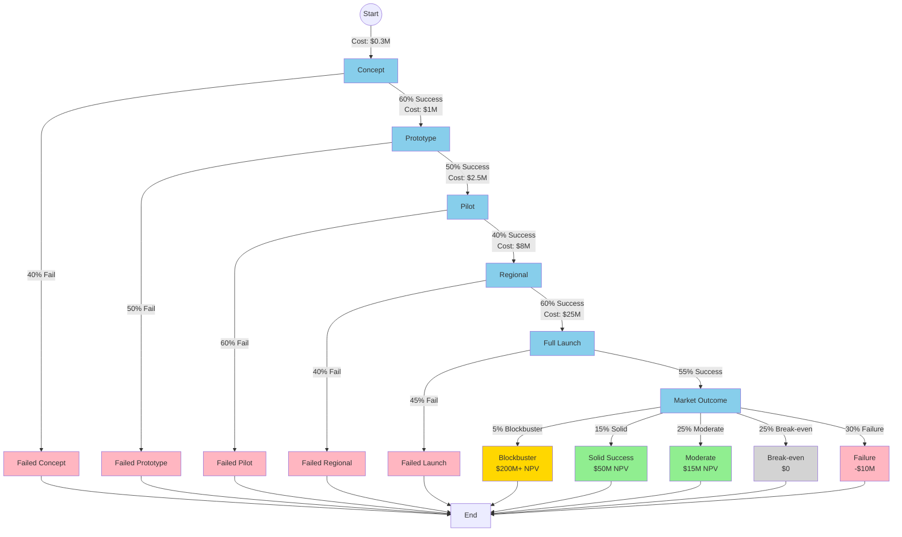

# Case Study: New Product Launch Decision

## Overview

Launching a new product is one of the most consequential decisions a company makes. It requires significant investment in R&D, manufacturing, marketing, and distribution - all before knowing whether customers will actually buy it. The decision involves multiple stages with uncertain outcomes at each point, from concept validation to market rollout.

Product launches fail 40-90% of the time (depending on the industry), making this a classic high-stakes decision under uncertainty. The Petersburg framework helps model the sequential nature of launch decisions and identify the most critical decision points.

## The Decision Process

### Product Launch Stages

1. **Concept Development** (3-6 months)
   - Market research and customer discovery
   - Competitive analysis
   - Initial business case
   - Cost: $50K-$500K
   - Success rate: ~60% proceed to prototype

2. **Prototype & Testing** (6-12 months)
   - Build MVP or prototype
   - Internal testing and refinement
   - Early customer feedback
   - Cost: $200K-$2M
   - Success rate: ~50% proceed to pilot

3. **Pilot Launch** (3-6 months)
   - Limited market test (single region or channel)
   - Real customer validation
   - Operational proof of concept
   - Cost: $500K-$5M
   - Success rate: ~40% proceed to full launch

4. **Regional Launch** (6-12 months)
   - Launch in primary target market
   - Scale production and distribution
   - Major marketing campaign
   - Cost: $2M-$20M
   - Success rate: ~60% proceed to national/global

5. **Full Market Launch** (12+ months)
   - Nationwide or global rollout
   - Maximum marketing and distribution
   - Cost: $10M-$100M+
   - Outcomes: Blockbuster, Success, Break-even, or Failure

## Market Outcome Distribution

Once fully launched, products typically fall into these categories:

- **Blockbuster** (5%): Exceeds expectations, >$100M revenue, high margins
- **Solid Success** (15%): Meets expectations, profitable, sustainable
- **Moderate Success** (25%): Marginally profitable, meets low end of projections
- **Break-even** (25%): Covers costs but doesn't generate significant profit
- **Failure** (30%): Losses, discontinued within 2 years

## Key Decision Points

At each stage, product teams face critical decisions:

### After Concept Phase:
- **Proceed to prototype**: Commit R&D resources
- **Pivot**: Adjust concept based on research
- **Kill**: Stop the project, cut losses

### After Prototype:
- **Proceed to pilot**: Scale to real market test
- **Iterate**: Go back to refinement based on feedback
- **Kill**: Abandon after prototype failure

### After Pilot:
- **Full launch**: Commit to major investment
- **Limited launch**: Soft rollout with constraints
- **Kill**: Abandon despite prototype success

### During Launch:
- **Accelerate**: Invest more to capture market faster
- **Maintain**: Stick to original plan
- **Pull back**: Reduce investment based on signals
- **Shut down**: Exit market and minimize losses

## Real-World Example: Consumer Electronics Product

Consider launching a new smart home device:

### Stage 1: Concept (Success)
- Market research shows 45% interest among target demographic
- Competitive analysis shows gaps in current offerings
- Initial business case projects $50M annual revenue potential
- **Decision**: Proceed to prototype

### Stage 2: Prototype (Mixed Signals)
- Engineering prototype works but unit cost is 30% higher than projected
- Focus group testing shows 75% satisfaction but concerns about price
- Early adopters willing to pay premium, but mass market skeptical
- **Decision**: Proceed to pilot with premium positioning

### Stage 3: Pilot (Weak Performance)
- Launch in one region with limited distribution
- Sales are 40% below target
- Customer reviews are positive (4.2/5) but awareness is low
- Unit economics work but volume is concerning
- **Decision Point**: This is the critical moment

### Inversion Analysis at Pilot Stage:

**Question: What would have to be true for this to be a $50M/year business?**

Working backward:
- Need 100K units/year at $500 average price
- Conversion rate: 2% of exposed customers
- Need to reach 5M potential customers/year
- Pilot showed: 1% conversion among those aware
- Therefore: Need to double conversion OR reach 10M customers

**Key uncertainties:**
1. Is low conversion because of product/price mismatch?
2. Is low conversion because of insufficient awareness?
3. Will conversion improve with scale (network effects, reviews)?

**Options:**
- **Option A**: Reduce price 20%, hope to double volume → More market research needed
- **Option B**: Increase marketing 3x, maintain price → Riskier but higher upside
- **Option C**: Pivot to premium niche, reduce volume expectations → Safer but lower ceiling
- **Option D**: Kill project, save $20M in launch costs

## Why This Fits Petersburg Framework

1. **Sequential stages**: Each stage builds on previous success
2. **Compounding uncertainty**: Must succeed at ALL stages to reach market
3. **Increasing investment**: Later stages cost exponentially more
4. **Irreversible costs**: Sunk costs cannot be recovered
5. **Multiple terminal states**: Wide range of outcomes from failure to blockbuster
6. **Real options**: Each stage purchases an option to continue
7. **Path dependencies**: Early decisions (positioning, features) affect later probabilities

## Case Study: Real Product Launches

### Success: Apple AirPods (2016)

**Stage outcomes:**
- Concept: Strong vision for wireless future
- Prototype: Technical challenges (connectivity, battery) solved
- Pilot: Launched alongside iPhone 7 (removed headphone jack)
- Launch: Initially mocked, became cultural phenomenon
- Outcome: $12B+ annual revenue by 2020

**Key insight**: Market conditions changed (iPhone 7 jack removal) which dramatically improved adoption. The decision to bundle launch with iPhone was brilliant positioning.

### Failure: Amazon Fire Phone (2014)

**Stage outcomes:**
- Concept: Differentiate with 3D interface and shopping features
- Prototype: Technical execution was solid
- Pilot: AT&T exclusive limited testing
- Launch: $449 price point, heavy marketing
- Outcome: Massive failure, discontinued after 1 year, $170M writedown

**Key insight**: Pilot signals were weak (limited interest) but Amazon proceeded to full launch anyway. Should have killed or pivoted after pilot.

### Mixed: Google Glass (2013)

**Stage outcomes:**
- Concept: Revolutionary vision for AR glasses
- Prototype: Strong tech demo, early adopter excitement
- Pilot: "Explorer" program at $1,500
- Launch: Never achieved full launch, pivoted to enterprise
- Outcome: Consumer product killed, reborn as enterprise tool

**Key insight**: Pilot revealed consumer market wasn't ready (privacy concerns, social stigma) but enterprise had clear use cases. Successful pivot after recognizing consumer path was blocked.

## Strategic Implications

### For Product Teams:

1. **Kill early and often**: 50-60% should die before pilot
2. **Pilot is critical**: This is where most false positives are caught
3. **Price/positioning**: Early decisions are hard to reverse later
4. **Market timing**: Sometimes being too early is indistinguishable from being wrong

### For Executives:

1. **Portfolio approach**: Launch multiple products, expect most to fail
2. **Stage gates**: Rigorous go/no-go criteria at each stage
3. **Sunk cost fallacy**: Don't throw good money after bad
4. **Option thinking**: Early stages are cheap options on future big bets

### For Investors:

1. **Proof points**: Demand evidence at each stage before next funding
2. **Pilot results**: Pay premium attention to pilot market performance
3. **Management quality**: How teams respond to weak signals matters more than initial concept

## Decision Framework

### Green Light Criteria (Proceed):
- Concept: 40%+ customer interest, clear differentiation
- Prototype: 70%+ satisfaction, unit economics work
- Pilot: Hit 70%+ of volume targets, positive unit economics
- Regional: Proven scalability, clear path to profitability

### Yellow Light Criteria (Proceed with Caution):
- Mixed signals but clear path to improvement
- One key metric weak but explainable
- Market conditions changing favorably

### Red Light Criteria (Kill):
- Fundamental economics don't work
- Customer satisfaction <60%
- Pilot sales <50% of target with no clear fix
- Market dynamics changed unfavorably

## Probabilistic Modeling

### Base Case Scenario:
- Concept → Prototype: 60%
- Prototype → Pilot: 50%
- Pilot → Regional: 40%
- Regional → Full: 60%
- Full → Success: 55%
- **Overall success probability**: 3.96%

### With Strong Market Validation:
- Concept → Prototype: 75%
- Prototype → Pilot: 65%
- Pilot → Regional: 60%
- Regional → Full: 75%
- Full → Success: 70%
- **Overall success probability**: 14.6%

### With Weak Product-Market Fit:
- Concept → Prototype: 40%
- Prototype → Pilot: 35%
- Pilot → Regional: 25%
- Regional → Full: 40%
- Full → Success: 35%
- **Overall success probability**: 0.49%

## The Power of Early Validation

The math shows that improving early-stage success rates has exponential impact:

- 10% improvement in concept validation → 10% better outcomes overall
- 10% improvement at EACH stage → 61% better outcomes overall

This is why companies like Amazon, Google, and Apple invest heavily in:
- Deep customer research before committing to prototypes
- Extensive user testing of prototypes
- Careful pilot market selection and analysis
- Rigorous stage-gate review processes

## References

- Harvard Business Review: "The Hard Truth About Innovative Cultures"
- Nielsen: "New Product Success Rates"
- CB Insights: "Why Products Fail"
- Clayton Christensen: "The Innovator's Dilemma"
- Steve Blank: "The Four Steps to the Epiphany"
