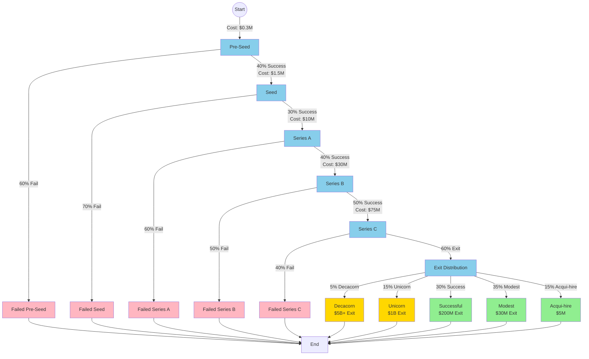

# Case Study: Startup Funding Journey

## Overview

The venture capital funding process is a multi-stage journey where startups progressively raise larger rounds of capital while hitting specific milestones. Like drug development, it's a sequential decision process with massive uncertainty and asymmetric outcomes. Most startups fail, but the rare successes can return 100-1000x on investment.

The journey from pre-seed to IPO involves multiple decision points where both founders and investors must decide whether to continue, pivot, or shut down. Each funding round represents a "checkpoint" where the startup's survival depends on convincing investors that future success is likely.

## The Decision Process

### Funding Stage Structure

1. **Pre-Seed Stage**
   - Bootstrap or raise $50K-$500K from friends, family, angels
   - Milestone: Build MVP, validate idea
   - Success rate: ~40% reach seed stage
   - Timeline: 6-12 months

2. **Seed Stage**
   - Raise $500K-$2M from seed funds and angels
   - Milestone: Product-market fit, initial traction
   - Success rate: ~30% reach Series A
   - Timeline: 12-18 months

3. **Series A**
   - Raise $2M-$15M (average ~$13M) from VCs
   - Milestone: Proven business model, revenue growth
   - Success rate: ~40% reach Series B
   - Timeline: 18-24 months

4. **Series B**
   - Raise $10M-$50M from growth-stage VCs
   - Milestone: Scale operations, expand market
   - Success rate: ~50% reach Series C
   - Timeline: 18-24 months

5. **Series C+**
   - Raise $50M+ for major expansion
   - Milestone: Market leadership, profitability path
   - Success rate: ~60% reach exit (IPO/acquisition)
   - Timeline: 24+ months

6. **Exit Events**
   - **IPO**: Public offering, valuation $1B-$100B+
   - **Acquisition**: Bought by larger company, typically $100M-$10B
   - **Failure**: Shutdown, acqui-hire, or fire sale

## Key Decision Points

At each funding round, multiple parties face critical decisions:

### For Founders:
- **Raise more capital**: Dilute ownership to fuel growth
- **Bootstrap/extend runway**: Reduce burn rate, delay next round
- **Pivot**: Change business model or target market
- **Shut down**: Return remaining capital to investors

### For Investors:
- **Lead the round**: Commit large capital and set terms
- **Follow**: Participate with smaller check
- **Pass**: Decline to invest, potentially signaling concerns
- **Bridge**: Provide interim funding to extend runway

The critical insight: **Each funding round is both a validation and a commitment**. Getting funded proves you passed the last test, but commits you to hit even bigger milestones for the next round.

## Inversion Analysis

A key question founders and VCs ask: **"What would have to be true for this startup to return the fund?"**

### For a $100M VC Fund:
- Need to return 3x ($300M) to be a top-quartile fund
- Typical portfolio: 20-30 companies
- Power law dynamics: 1-2 winners drive most returns
- Therefore, each investment needs potential for 10-100x return

### Working Backward from Success:
1. **Required exit**: Company valued at $1B+ (unicorn)
2. **Series C requirements**:
   - Annual revenue: $50-100M+
   - Growth rate: 100%+ YoY
   - Clear path to $500M+ revenue
3. **Series B requirements**:
   - Annual revenue: $10-20M
   - Growth rate: 200%+ YoY
   - Proven go-to-market model
4. **Series A requirements**:
   - Annual revenue: $1-3M
   - Strong unit economics
   - Large addressable market ($1B+)
5. **Seed requirements**:
   - Product-market fit indicators
   - Early customer traction
   - Exceptional founding team

## Why This Fits Petersburg Framework

1. **Sequential decisions**: Each round depends on success in prior stages
2. **Compounding probabilities**: Overall success = product of all stage success rates
3. **Increasing costs**: Each round requires more capital at higher valuations
4. **Path dependencies**: Early decisions (market choice, business model) affect later probabilities
5. **Multiple terminal states**: From total failure to decacorn success
6. **Asymmetric payoffs**: Most investments lose 100%, rare winners return 1000x+
7. **Option value**: Each round purchases an option to continue

## Real-World Examples

### Success Story: Stripe
- **2010 - Pre-seed**: Y Combinator, $20K
- **2011 - Seed**: $2M at ~$20M valuation
- **2012 - Series A**: $18M at ~$100M valuation
- **2014 - Series B**: $80M at $1.75B valuation
- **2016 - Series C**: $150M at $9.2B valuation
- **2023 - Series I**: Valued at $50B+
- **Current**: Private valuation ~$50-70B

**Key insight**: At each stage, they hit milestones that de-risked the next round. Early focus on developer experience and API quality enabled exponential growth.

### Failure Story: Theranos
- Raised $700M+ across multiple rounds
- Peak valuation: $9B (2015)
- **2018**: Shut down, fraud charges
- **Terminal outcome**: Total loss for most investors

**Key insight**: Faked milestones and misrepresented technology. The framework would have flagged this IF accurate data was used - the probabilities were based on false information.

### Median Story: Most Startups
- 90% of startups fail
- Median failure point: Between seed and Series A
- Median time to failure: 20 months
- Median capital raised before failure: $1.3M

## Strategic Implications

### For Founders:
1. **Milestone planning**: Work backward from Series A to determine seed goals
2. **Runway management**: Always have 18+ months of cash
3. **Pivot timing**: Early pivots (pre-Series A) are cheaper than late pivots
4. **Signal strength**: Each round requires stronger proof points

### For Investors:
1. **Portfolio construction**: Need 20-30 bets to capture 1-2 big winners
2. **Follow-on strategy**: Reserve capital to double-down on winners
3. **Stage selection**: Early stage (higher risk/return) vs. growth stage (lower risk/return)
4. **Syndicate strategy**: Co-invest to diversify and share due diligence

### For Policymakers:
1. **Ecosystem health**: Success rates depend on mentor networks, talent pools
2. **Capital availability**: Funding gaps at certain stages kill promising companies
3. **Exit opportunities**: Need liquid exit markets (public markets, M&A)

## Probabilistic Scenarios

### Optimistic Scenario (Top 1%):
- Pre-seed → Seed: 60% success
- Seed → Series A: 50%
- Series A → Series B: 60%
- Series B → Series C: 70%
- Series C → Unicorn Exit: 80%
- **Overall probability**: 10.08% chance of unicorn exit

### Base Case (Average):
- Pre-seed → Seed: 40%
- Seed → Series A: 30%
- Series A → Series B: 40%
- Series B → Series C: 50%
- Series C → Exit: 60%
- **Overall probability**: 1.44% chance of successful exit

### Pessimistic Scenario (Bottom quartile):
- Pre-seed → Seed: 20%
- Seed → Series A: 15%
- Series A → Series B: 25%
- Series B → Series C: 30%
- Series C → Exit: 40%
- **Overall probability**: 0.09% chance of successful exit

## The "Valley of Death"

The most dangerous phase is between seed and Series A, often called the "Valley of Death":

- Longest timeline (12-24 months)
- Lowest success rate (~30%)
- Highest burn rate (hired team, scaling costs)
- Highest competitive pressure (market window closing)

Many startups run out of money here after convincing seed investors but before proving the model to Series A investors.

## References

- CB Insights: "The Top 20 Reasons Startups Fail"
- First Round Capital: "State of Startups 2024"
- Correlation Ventures: "Benchmarking as the Basis of VC Decisions"
- Startup Genome: "Global Startup Ecosystem Report"
