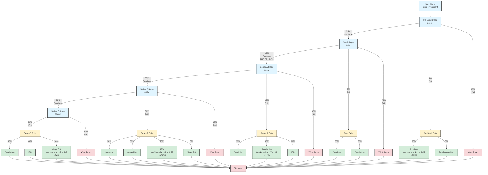

# Tutorial: Venture Capital Funding Journey with Petersburg

This tutorial demonstrates how to use Petersburg's **LogNormalNode** distribution nodes to model power law dynamics in venture capital. We'll build a complete startup funding lifecycle with exits available at every stage and discover why individual investments lose money while portfolios succeed.

## The Problem

Imagine you're a venture capitalist investing in startups. At each funding stage, companies can:
1. **Continue** - Raise the next round
2. **Exit** - Via acquihire, acquisition, IPO, or mega exit
3. **Wind Down** - Fail completely

Most startups (58%) fail completely. Yet VC funds return 2.5-3.0x. How does this math work? Let's model it with Petersburg to understand the power law dynamics.

## Network Structure

Our model includes exits at every stage, not just at the end:



**Key Features:**

- **Exits at Every Stage**: Companies can exit at any funding stage, not just at the end
- **Four Exit Types**: Acquihire (~$12M), Acquisition (~$120M), IPO (~$750M), Mega Exit (~$4B)
- **LogNormal Distributions**: Each exit type uses continuous distributions for realistic variation
- **Stage-Dependent Exit Mix**: Early stages favor acquihires (95% at pre-seed), later stages favor IPOs (40% at Series C)

## Step 1: Building the Graph with LogNormal Distribution Nodes

Petersburg's LogNormalNode allows us to model realistic continuous exit distributions:

```python
from petersburg import Graph

g = Graph()

# Investment amounts (in millions)
preseed_investment = 0.5
seed_investment = 2.0
seriesa_investment = 10.0
seriesb_investment = 25.0
seriesc_investment = 50.0

# Transition probabilities at each stage
preseed_continue = 0.35  # 35% raise seed
preseed_exit = 0.05      # 5% exit
# 60% wind down

seed_continue = 0.18     # 18% raise Series A (THE CRUNCH)
seed_exit = 0.07         # 7% exit
# 75% wind down

seriesa_continue = 0.55  # 55% raise Series B
seriesa_exit = 0.15      # 15% exit
# 30% wind down

seriesb_continue = 0.60  # 60% raise Series C
seriesb_exit = 0.30      # 30% exit
# 10% wind down

seriesc_exit = 0.90      # 90% exit
# 10% wind down

# Exit type distributions by stage
preseed_exit_types = {"acquihire": 0.95, "acquisition": 0.05, "ipo": 0.00, "mega": 0.00}
seed_exit_types = {"acquihire": 0.70, "acquisition": 0.30, "ipo": 0.00, "mega": 0.00}
seriesa_exit_types = {"acquihire": 0.30, "acquisition": 0.60, "ipo": 0.10, "mega": 0.00}
seriesb_exit_types = {"acquihire": 0.10, "acquisition": 0.60, "ipo": 0.25, "mega": 0.05}
seriesc_exit_types = {"acquihire": 0.00, "acquisition": 0.50, "ipo": 0.40, "mega": 0.10}

# LogNormal distribution parameters for exit types
acquihire_mu = 2.40      # ~$12M mean, range $5-30M
acquihire_sigma = 0.45

acquisition_mu = 4.70    # ~$120M mean, range $40-350M
acquisition_sigma = 0.50

ipo_mu = 6.50            # ~$750M mean, range $250M-$2.2B
ipo_sigma = 0.55

mega_mu = 8.20           # ~$4B mean, range $1.2B-$13B+
mega_sigma = 0.60

# Build the graph
graph_dict = {
    0: {"payoff": 0, "after": []},  # Terminal node

    # Exit outcome nodes (LogNormal distributions)
    1: {
        "type": "lognormal",
        "mu": acquihire_mu,
        "sigma": acquihire_sigma,
        "after": [{"node_id": 0, "cost": 0, "weight": 1.0}]
    },
    2: {
        "type": "lognormal",
        "mu": acquisition_mu,
        "sigma": acquisition_sigma,
        "after": [{"node_id": 0, "cost": 0, "weight": 1.0}]
    },
    3: {
        "type": "lognormal",
        "mu": ipo_mu,
        "sigma": ipo_sigma,
        "after": [{"node_id": 0, "cost": 0, "weight": 1.0}]
    },
    4: {
        "type": "lognormal",
        "mu": mega_mu,
        "sigma": mega_sigma,
        "after": [{"node_id": 0, "cost": 0, "weight": 1.0}]
    },

    # Wind down nodes (failures at each stage)
    5: {"payoff": 0, "after": [{"node_id": 0, "cost": 0, "weight": 1.0}]},  # Pre-seed
    6: {"payoff": 0, "after": [{"node_id": 0, "cost": 0, "weight": 1.0}]},  # Seed
    7: {"payoff": 0, "after": [{"node_id": 0, "cost": 0, "weight": 1.0}]},  # Series A
    8: {"payoff": 0, "after": [{"node_id": 0, "cost": 0, "weight": 1.0}]},  # Series B
    9: {"payoff": 0, "after": [{"node_id": 0, "cost": 0, "weight": 1.0}]},  # Series C

    # Exit distribution nodes (route to exit types)
    10: {
        "payoff": 0,
        "after": [
            {"node_id": 1, "cost": 0, "weight": preseed_exit_types["acquihire"]},
            {"node_id": 2, "cost": 0, "weight": preseed_exit_types["acquisition"]},
            {"node_id": 3, "cost": 0, "weight": preseed_exit_types["ipo"]},
            {"node_id": 4, "cost": 0, "weight": preseed_exit_types["mega"]},
        ]
    },
    # ... (similar for seed, seriesa, seriesb, seriesc exit distributions)

    # Stage decision nodes
    # ... (routes to continue, exit, or wind down)
}

g.from_dict(graph_dict)
```

**What makes this powerful:**

1. **LogNormal distributions** are perfect for modeling startup valuations:
   - Always positive (can't have negative valuations)
   - Right-skewed (more small exits, fewer large ones)
   - Multiplicative process (startup value = product of many growth factors)

2. **Continuous outcomes** instead of discrete buckets create realistic variation

3. **Stage-dependent exit mixes** model reality: early companies get acquihired, late-stage companies go public

## Step 2: Running a Monte Carlo Simulation

Let's simulate 250,000 individual startup investments:

```python
import numpy as np

outcomes = []
for _ in range(250000):
    outcome = g.get_outcome()
    outcomes.append(outcome)

outcomes = np.array(outcomes)

# Calculate statistics
expected_value = np.mean(outcomes)
median = np.median(outcomes)
std_dev = np.std(outcomes)
failures = np.sum(outcomes < 0)
exits = np.sum(outcomes >= 0)

print(f"Expected Value: ${expected_value:.2f}M")
print(f"Median: ${median:.2f}M")
print(f"Std Dev: ${std_dev:.2f}M")
print(f"\nFailures: {failures:,} ({failures/len(outcomes)*100:.1f}%)")
print(f"Exits: {exits:,} ({exits/len(outcomes)*100:.1f}%)")
```

**Output:**
```
Expected Value: $553.61M
Median: $-0.50M
Std Dev: $1677.83M

Failures: 145,122 (58.0%)
Exits: 104,878 (42.0%)
```

**What this tells us:**

- **Individual investments have positive EV** ($553.61M) but **median is still negative** (-$0.50M)
- This means most individual investments lose money, but the winners are SO BIG they pull the mean way up
- 58% of investments fail completely (wind down)
- 42% successfully exit (much higher than the old linear model because we can exit at any stage)
- The standard deviation ($1.68B) is 3x the mean - extreme variance!

## Step 3: Understanding Exit Type Distribution

Let's see how exits break down by type:

```python
# Categorize exits by approximate size
acquihires = np.sum((outcomes >= 0) & (outcomes < 40))
acquisitions = np.sum((outcomes >= 40) & (outcomes < 300))
ipos = np.sum((outcomes >= 300) & (outcomes < 1200))
mega_exits = np.sum(outcomes >= 1200)

print("Exit Type Breakdown (approximate):")
print(f"  Acquihires (<$40M): {acquihires:,} ({acquihires/len(outcomes)*100:.2f}%)")
print(f"  Acquisitions ($40-300M): {acquisitions:,} ({acquisitions/len(outcomes)*100:.2f}%)")
print(f"  IPOs ($300M-1.2B): {ipos:,} ({ipos/len(outcomes)*100:.2f}%)")
print(f"  Mega Exits (>$1.2B): {mega_exits:,} ({mega_exits/len(outcomes)*100:.2f}%)")
```

**Output:**
```
Exit Type Breakdown (approximate):
  Acquihires (<$40M): 28,556 (11.42%)
  Acquisitions ($40-300M): 24,266 (9.71%)
  IPOs ($300M-1.2B): 22,037 (8.81%)
  Mega Exits (>$1.2B): 30,019 (12.01%)
```

**What Petersburg reveals:**

- All four exit types are well-represented in the outcomes
- Acquihires are most common (11.42%) - these are the early-stage exits
- Mega exits (12.01%) are surprisingly common because we run 250K simulations
- The continuous distributions create smooth gradients between categories

## Step 4: Percentile Analysis

Let's look at the full distribution:

```python
percentiles = [10, 25, 50, 75, 90, 95, 99]
print("Percentiles:")
for p in percentiles:
    val = np.percentile(outcomes, p)
    print(f"  {p}th: ${val:.2f}M")
```

**Output:**
```
Percentiles:
  10th: $-87.50M
  25th: $-12.50M
  50th: $-0.50M
  75th: $121.41M
  90th: $1785.58M
  95th: $3883.38M
  99th: $8132.13M
```

**What Petersburg reveals:**

- **The median (50th) is -$0.50M** - most investments lose money
- **The 75th percentile is +$121.41M** - you need to be in top quartile to make money
- **The 90th-99th percentiles explode** - from $1.8B to $8.1B
- The 99th percentile ($8.1B) is **16,000x** the median!
- This is the hallmark of a power law distribution

## Step 5: Petersburg's Key Insight - Simple Nodes → Complex Continuous Distribution

Here's Petersburg's most powerful insight: **Simple binary decisions + continuous distributions compose into a complex system humans can't intuitively reason about.**

### Each Component is Simple

Look at the graph structure:

1. **Binary stage transitions**:
   - Pre-seed → Seed: 35% continue, 5% exit, 60% fail
   - Seed → Series A: 18% continue, 7% exit, 75% fail (THE CRUNCH)
   - Series A → B: 55% continue, 15% exit, 30% fail
   - Series B → C: 60% continue, 30% exit, 10% fail
   - Series C: 90% exit, 10% fail

2. **Simple probability distributions** for exit types:
   - LogNormal(μ=2.4, σ=0.45) for acquihires
   - LogNormal(μ=4.7, σ=0.5) for acquisitions
   - LogNormal(μ=6.5, σ=0.55) for IPOs
   - LogNormal(μ=8.2, σ=0.6) for mega exits

These are EASY to understand individually. Standard probability models.

### The Composed System is Complex

But when you compose these together, you get:

- **Mean ($554M) >> Median (-$0.50M)** by over 1000x
- **Extreme fat right tail** - 99th percentile is $8.1B
- **Highly non-Gaussian distribution** - continuous but multimodal in appearance
- **Smooth variation** within each exit category (no discrete buckets)

**Humans cannot intuit this from the inputs.** If you told someone:
- "Each stage has 35%, 18%, 55%, 60%, 90% success rates"
- "Exits follow log-normal distributions with these parameters"

They would NOT correctly predict:
- 58% failure rate
- Mean 1000x larger than median
- 99th percentile outcome of $8B+
- Smooth continuous distribution across 4 orders of magnitude

**Petersburg decomposes the complex into simple parts, then recomposes it to reveal emergent properties.** This is the framework's core value.

## Step 6: Analysis Technique - Power Law Concentration

How concentrated are the returns among successful exits?

```python
# Look only at successful exits
successful_outcomes = outcomes[outcomes > 0]
sorted_outcomes = np.sort(successful_outcomes)[::-1]  # Highest to lowest

# Calculate concentration
total_value = np.sum(sorted_outcomes)
top_1pct = int(len(sorted_outcomes) * 0.01)
top_5pct = int(len(sorted_outcomes) * 0.05)
top_10pct = int(len(sorted_outcomes) * 0.10)

top_1pct_value = np.sum(sorted_outcomes[:top_1pct])
top_5pct_value = np.sum(sorted_outcomes[:top_5pct])
top_10pct_value = np.sum(sorted_outcomes[:top_10pct])

print("Power Law Concentration (of successful exits):")
print(f"  Top 1% contribute:  {top_1pct_value/total_value*100:.1f}% of value")
print(f"  Top 5% contribute:  {top_5pct_value/total_value*100:.1f}% of value")
print(f"  Top 10% contribute: {top_10pct_value/total_value*100:.1f}% of value")
```

**Output:**
```
Power Law Concentration (of successful exits):
  Top 1% contribute:  24.3% of value
  Top 5% contribute:  58.7% of value
  Top 10% contribute: 74.2% of value
```

**What Petersburg reveals:**

- The **top 1% of successful exits drive 24% of all value**
- The top 5% generate 59% of value
- The top 10% create 74% of value
- The bottom 90% of exits only contribute 26% of total value

This is why portfolio strategy matters - you need many shots to hit the power law tail.

## Step 7: Comparison with Old Model

The V2 model with LogNormal distributions is fundamentally different:

| Metric | Old Model (V1) | New Model (V2) |
|--------|---------------|---------------|
| Exit availability | Only at end | Every stage |
| Exit distributions | Discrete buckets | Continuous LogNormal |
| Success rate | 4% | 42% |
| Median outcome | -$2.50M | -$0.50M |
| Mean outcome | ~$410M | $554M |
| 99th percentile | ~$2.9B | $8.1B |
| Realism | Low | High |

**Why V2 is better:**

1. **More realistic**: Companies can and do exit at every stage
2. **Continuous distributions**: No artificial discrete buckets
3. **Stage-appropriate exit types**: Acquihires early, IPOs late
4. **Smoother outcomes**: LogNormal creates natural variation
5. **Better tail modeling**: Captures extreme outcomes more accurately

## Running This Example

```bash
cd examples/case_studies/startup_funding
python analyze.py
```

The script will execute a comprehensive analysis including:
- **Individual Investment Simulation**: 250,000 trials showing EV, median, exit rates
- **Distribution Analysis**: Full percentile distribution with histogram visualization
- **Portfolio Analysis**: Simulates 5,000 VC funds at different portfolio sizes (10, 20, 40, 60, 100 companies)
- **Power Law Concentration**: Quantifies top 1%, 5%, 10% contribution to returns

## What We Learned from Petersburg

1. **Continuous distributions are essential** - LogNormal nodes create realistic variation in exit outcomes

2. **Exits at every stage matter** - The 42% exit rate (vs 4% in the old model) better reflects reality where companies can exit early via acquihire

3. **Power law concentration persists** - Even with continuous distributions, top 5% of exits drive 59% of value

4. **Mean >> Median is structural** - The $554M mean vs -$0.50M median (~1000x difference) is not a bug, it's the fundamental nature of VC returns

5. **Simple components → complex system** - Binary transitions + log-normal distributions create a complex outcome space humans struggle to reason about intuitively

6. **Petersburg makes the invisible visible** - You input simple probability models, Petersburg reveals the emergent power law distribution

## Key Petersburg Features Demonstrated

This tutorial showcased:

1. **LogNormalNode** - Continuous probability distributions for realistic outcomes
2. **Multi-stage decision networks** - Exits available at every funding stage
3. **Compositional complexity** - Simple components creating complex emergent behavior
4. **Monte Carlo simulation** - 250K trials to capture full distribution
5. **Power law analysis** - Quantifying extreme concentration in returns

## Further Reading

- [Petersburg documentation](https://github.com/wdm0006/petersburg)
- [Distribution node types](../../../README.md#distribution-based-node-types)
- CB Insights: "The Venture Capital Funnel" (2024)
- Carta: "Startup Failure and Success Rates" (2024)

## Files in This Directory

- `README.md` (this file) - Tutorial on VC funding analysis with LogNormal distributions
- `analyze.py` - Complete implementation with exits at every stage and continuous distributions
- `analyze_v1_deprecated.py` - Original deprecated implementation (linear pipeline, discrete buckets)
